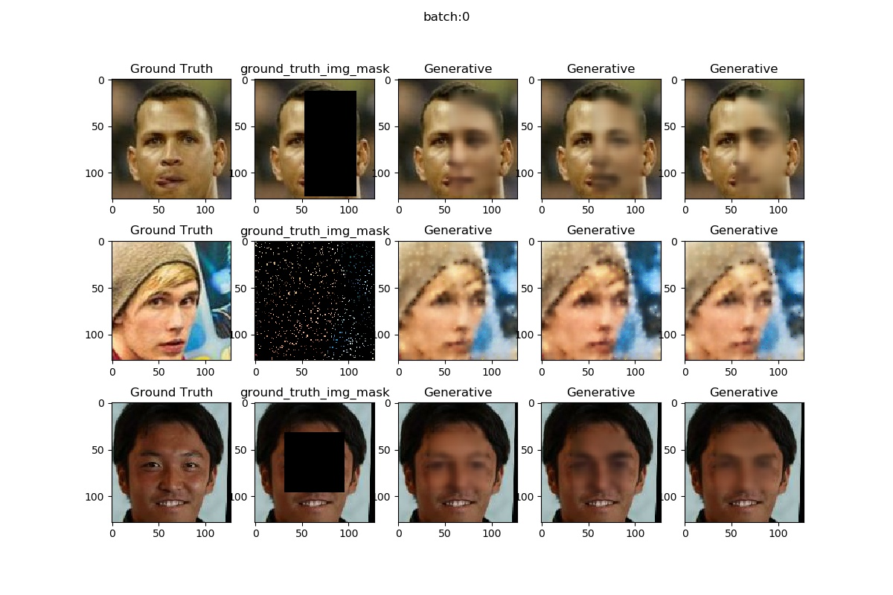
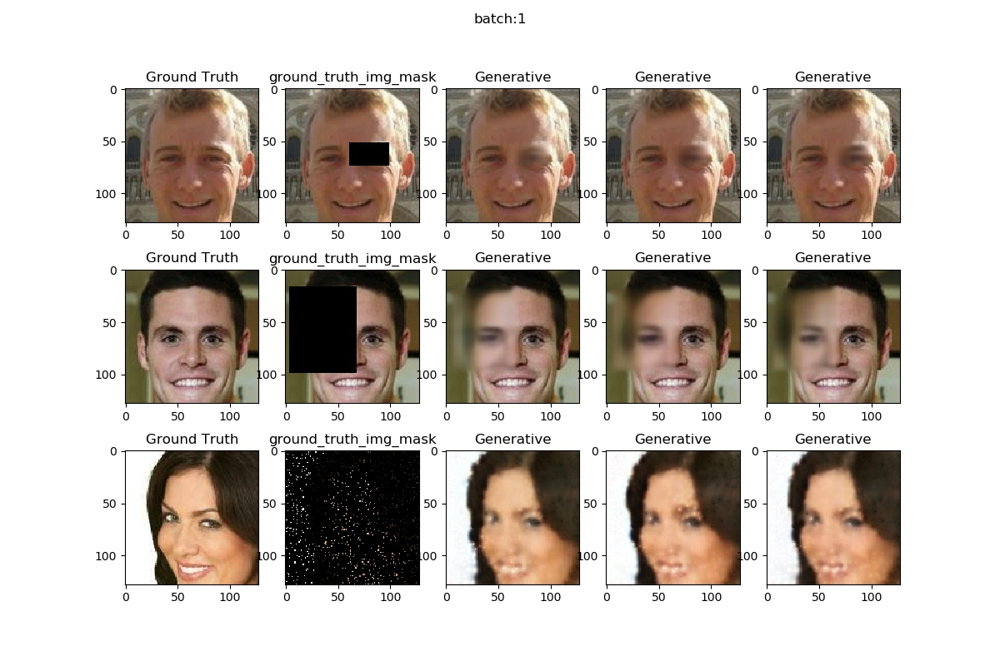
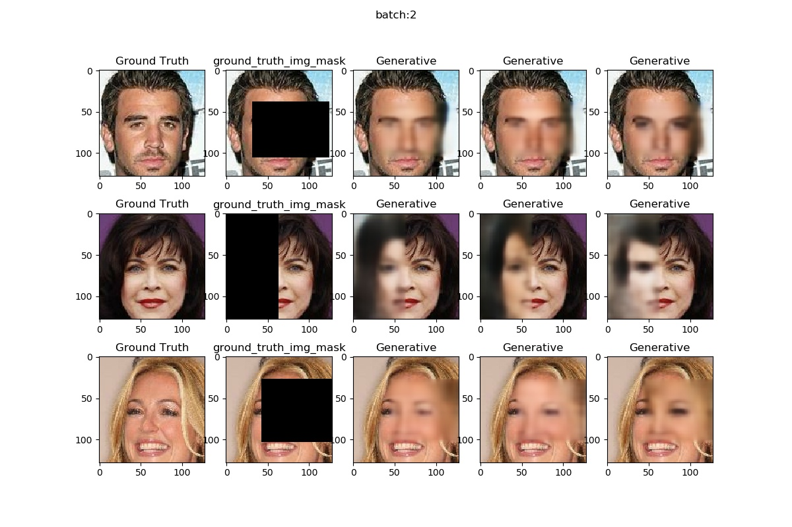
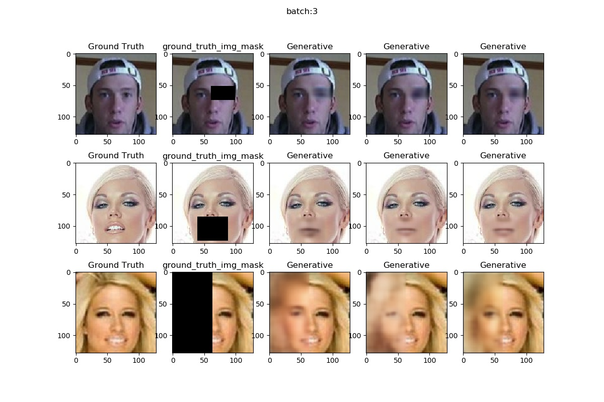
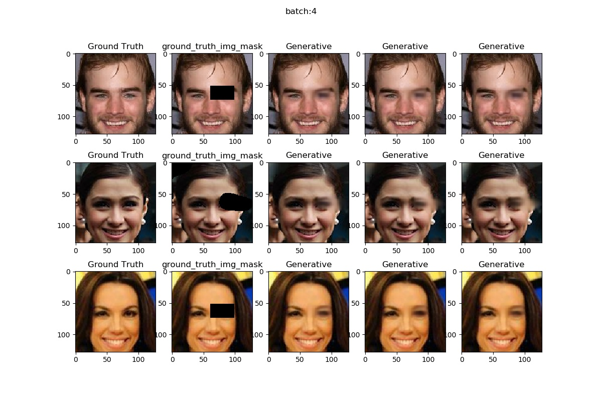
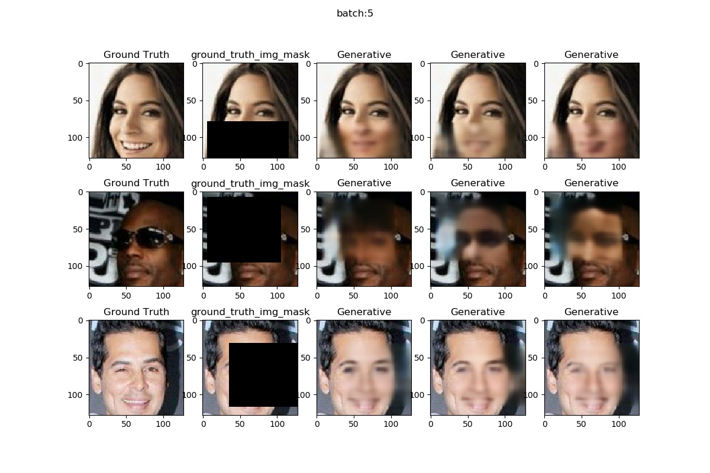
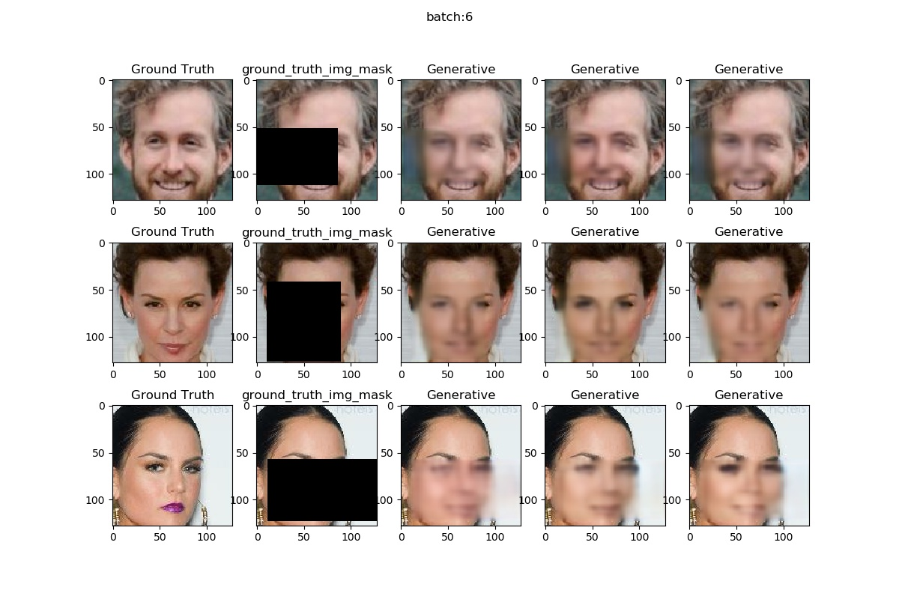
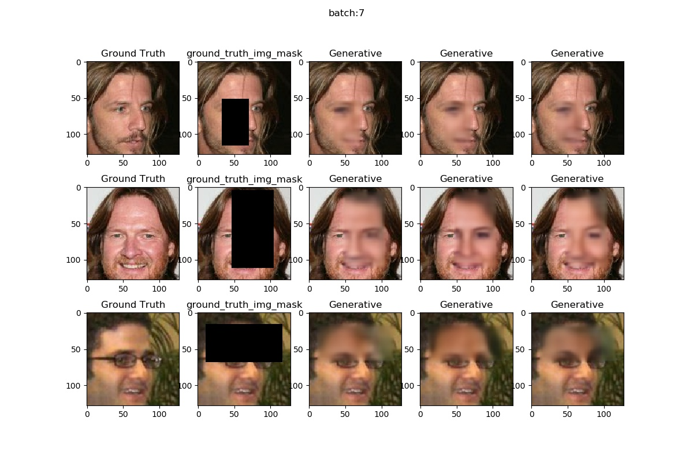
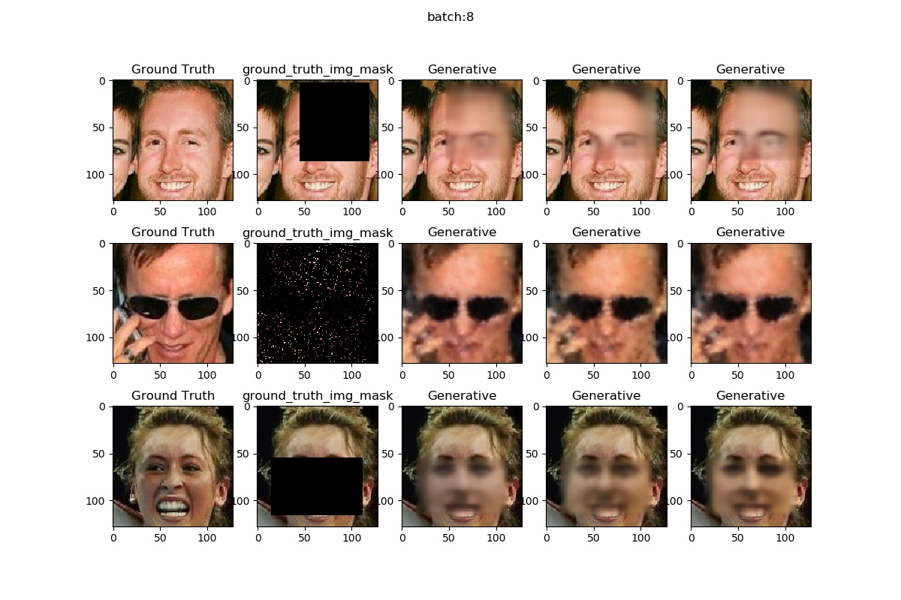
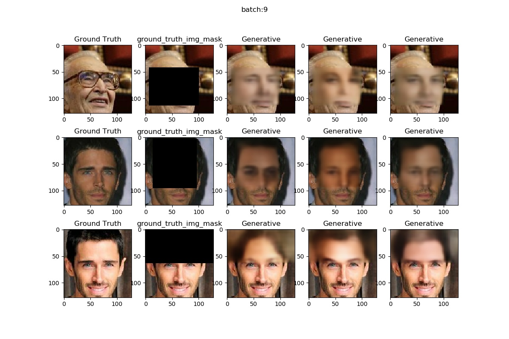

# Tensorflow version of "Variational Autoencoder with Arbitrary Conditioning"

The original Pytorch implementation: https://github.com/tigvarts/vaeac

Variational Autoencoder with Arbitrary Conditioning (VAEAC) is
a neural probabilistic model based on variational autoencoder
that can be conditioned on an arbitrary subset of observed features and
then sample the remaining features.

Oleg Ivanov, Michael Figurnov, Dmitry Vetrov.
Variational Autoencoder with Arbitrary Conditioning, ICLR 2019,
[link](https://openreview.net/forum?id=SyxtJh0qYm).


## Setup

This implementation use tensorflow eager execution.

Need Tensorflow > 1.3 or Tensorflow 2.0

To run experiments with CelebA download dataset,
unzip `img_align_celeba.zip`(1.44G) to `data_celeba/`.

Download `list_eval_partition` to `data_celeba/`


## Inpainting

Image inpainting process is splitted into several stages:   
1.Firstly one define a model together with its optimizer, loss and
mask generator in `model_tf.py` file in a separate directory.
Such model for the paper is provided in `celeba_model` directory.    
2.Secondly, one implement image datasets (train, validation and test images
together with test masks), and add them into `datasets_tf.py`.
One can use CelebA dataset which is already implemented (but not downloaded!)
and skip this step.     
3.Then one train the model for 40 epoch using
```
python train_tf.py
```

The weights will saved in `celeba_model/weights/`.

We have saved pre-trained model in `celeba_model/weights/model_best.h5`, one can use it directly.

4.After that, one can inpaint the test set by calling
```
python inpaint_tf.py
```
The inpaint file will saved at `result/`

## Result

**Intuitively, the quality of the image generated by our method has not meet the original Pytorch version.**

**If you find any problems in the code, please let us know.**






















## Citation
```
@inproceedings{
    ivanov2018variational,
    title={Variational Autoencoder with Arbitrary Conditioning},
    author={Oleg Ivanov and Michael Figurnov and Dmitry Vetrov},
    booktitle={International Conference on Learning Representations},
    year={2019},
    url={https://openreview.net/forum?id=SyxtJh0qYm},
}
```
